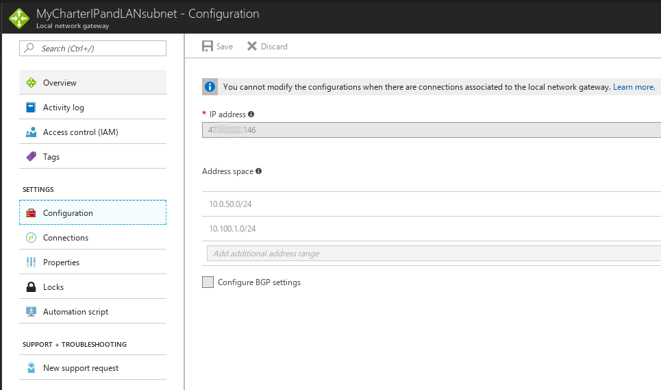

IPsec Tunnel between Azure Virtual Network and pfSense
============================

Quick Links
-------------
* [First create a resource Group](#resourcegroup)
* [Create a public IP address](#publicIP)
* [Creating a Virtual Network, and First Subnet](#virtualnetwork)
* [Now we need to set up our Gateway Subnet](#gatewaysubnet)
* [Create the Virtual Network Gateway](#virtualnetworkgateway)
* [Create a Local Network Gateway definition](#localnetworkgateway)
* [Create a Site to Site VPN Connection](#sitetositevpn)
* [Setup pfSense to Connect to Azure through IPsec](#setuppfsense)
* [Deploy a VM on Azure in your Virtual Network](#deployvm)
* [Pinging the Azure VM from pfSense or clients on the Local Network](#pingthevm)

### Multiple Phase 2s
* [Tunneling more than one subnet over the phase 1 IPSec](#tunneling2ormore)
* [On the Azure side](#azureSide)
* [On the pfSense side](#pfsenseSide)

**********

Creating a Resource Group
------------------
First create a resource group that will be used to sort of organize everything else together in the same region. 
* Click resource groups on the left panel 
* Type a name for the resource Group and hit create.

Now lets create a public IP address for our IPSEC connection
-----------------------

 * ### If you're not sure where to find the public IP address settings
    * Just typed public IP address in the search bar at the top 
    * and as the results drop down under the services tab you will see an icon that says public IP addresses 
    * click the button. 
  
    * Alternatively you can click more services on the left and as you scroll down you should see one labeled public IP addresses.

* Name it something perhaps related to the location
  * For the SKU, we are using Basic.
  * We are staying with an ipv4 address 
  * We are leaving the address Dynamic as we do not have to worry about the address changing as long as we keep the name I believe, or it is attached to the same Gateway.
  * Use an existing Resource Group 
      * We will use the resource Group that we created at the start.

Creating a Virtual Network, and our first subnet
-------------------
* Click Virtual networks on the left panel 
* On the top click `+ Add` to add a Virtual Network.
* Choose a name for your Virtual Network
  * I'm going to choose something related to a Windows domain controller since that's what will be running on this subnet.

* Set the address space for something like a /16 to give you space for a bunch of /24s later
* For the resource Group, choose `Use existing` to use an existing Resource Group 
  * and pick the one you just created earlier, from this dropdown.
* Create a name for your first subnet, 
  * Choose an address range that fits within the Address Space that you created just above.

* If you have green check marks all the way down go ahead and head `Create`.

Hit refresh to see your newly created virtual Network.

**This first subnet network range will be the one that you use in your IKE Phase2 Remote Subnet in pfSense settings, as well as one of the subnets in the IPsec Firewall rules.**

Now we need to set up our Gateway Subnet
-------------------------

* On the left panel click `All Resources`
* From the Menu that appears, click on your Existing Virtual Network 
* On the sub-menu, click on `Subnets` to view the currently created subnets. 
* On the top right panel you will see a plus sign labeled  `Gateway Subnet`. 
* Click the plus sign to create a new `Gateway Subnet`.

* The name is grayed out so you will not be able to change it. 
* Choose an address range within the Address Space you set up when creating your Virtual Network, but different than your first subnet.

### It should look similar to this when you are finished

We need to create a Virtual Network Gateway
---------------------------

* Choose Network gateways from the left panel.
* Click add under the middle panel that pops up. 
* Under the panel labeled `Create Virtual Network Gateway`, put in a name maybe something like East-US-Vnet-GW1. 
* For Gateway type, choose VPN, 
* For VPN type choose route based, 
  * Route based VPN Gateway types are offered in three SKUs, Basic, Standard, and High-performance, we will just use Basic.
* Down a little under Virtual Network, choose The Virtual Network that you created earlier, from the list.
* For the public IP address, choose the address that you created earlier from the drop-down list. 
* Hit create.

### Note: This may take up to 45 minutes to complete deployment.

Create a Local Network Gateway definition
----------------------
* On the very left panel click `Local Network Gateways`
* At the top of the window choose the `+ ADD` button
* `Name` it something descriptive related to your on premises local network
* `IP address` will be the IP address  given by your ISP for your local site
* In `Address Space` enter the subnet in CIDR notation for the  local area network behind the pfSense router 
  * You way wish to add more than one subnet if there are more behind the pfSense router you wish to expose
* For `Resource Group`, use the existing one we created earlier
* Click create

Create a Site to Site VPN Connection
---------------------

* If not still on the `Local Network Gateway`, click the name of your `Local Network Gateway`
* and in the middle pane, click `Connections` 
* At the top we will `+ Add` a connection  
* Add a name for your site to site ipsec connection
* Choose a `Virtual Network Gateway` that we've previously set up
* The `local network Gateway` has already been selected
* Create a `Shared key` that will be a pre-shared key on both azure and pfSense
* Hit okay

Setup pfSense to Connect to Azure through IPsec !!
----------------------------
* Login to pfsense
* Go to the Top Menu bar and choose `VPN`
* Choose IPsec
* Visit https://docs.microsoft.com/en-us/azure/vpn-gateway/vpn-gateway-about-vpn-devices#ipsec for the IPsec parameters used on the Microsoft side in Azure

### Taken from there we see the IKE Phase 1 requirements

### And following are the IKE Phase 2 requirements

### Setting up our IKE Phase1 in pfSense like so
* The Key exchange can simply be set to auto
* The `Remote Gateway` will be the Public IP Address given on Azure
* Match the rest up to the specifications

### Setting up our IKE Phase2 in pfSense like so
* We used `Tunnel IPv4` Mode
* Local Network will be the subnet on premises you want to be visible to the Azure Subnet
* Remote Network is the subnet on the Azure side that you want to be visible to your Local Network on the premises.
* Didn't mess with key groups
* Lifetime does't match maybe? but it is working Perhaps it defaulted to IKEv1?

### Creating our Firewall rules to allow the traffic between subnets
* At the top menu bar, click `Firewall`
* Choose `Rules`
* Click `IPsec` to create rules for the IPsec interface
* Click `Add` to add a rule
* This rule allows traffice from the Azure 10.1.0.0/24 subnet to reach the VLAN50DATA net subnet
* We may need to add another rule going in the opposite direction eventually

Deploy a VM on Azure in your Virtual Network
--------------------

* In the left panel, click virtual machines
* click the create virtual machines button
* We're going to choose Windows server choose Windows Server 2012 R2 Datacenter
* For deployment model use resource manager
* Under basic configuration type a username and  password and 
* create using your existing Resource Group. 
  * ##### Note that your location may not support creating a VM under a free trial, in which case you will have to redo your whole networking scheme under a new resource location.
* Choose whatever options you need for a relative price point
* Most of the settings in step 3 will be pre-selected
* Then finally purchase the VM and it will provision

### Notice now in Overview of our Virtual Network
  * The Server is listed with an external and internal IP Address
 

Pinging the Azure VM from pfSense or clients on the Local Network
------------------------------
The pictures above may be inaccurate due to some changes of the Azure setup.

### The final Network Settings are 
* The local network is on the 10.0.50.0/24 subnet
* The address space in Azure is 10.1.0.0/16
* The first subnet is on 10.1.1.0/24
* The `Subnet Gateway` is on 10.1.2.0/14

### Final Virtual Network Settings in Azure

### The Firewall rules in pfSense allow traffic both ways between 10.1.1.0 and 10.0.50.0

### The pfSense IPsec Status shoud look like this

### Lets ping it using `Ping` in `Diagnostics`

### From a client on the same subnet

    

Multiple Phase 2s
=================
-----------------

Tunneling more than one subnet over the phase 1 IPSec
-------------------

In order to route between two different subnets from the ipsec Azure side to pfSense, you need to
add both of the subnets to azure and pfSense. On the Azure side you simply add more Address Spaces, and on the pfSense side you must create multiple phase2 definitions.

If you are modifying an ipsec connection, you will need to delete the existing VPN connection in Azure, and recreate it after adding more subnets to `Local Network Gateway`.

 On the Azure side: 
-------------

* Go to `All resources`
* Click your existing IPSec `Connection` 
* Delete it

In the `Local Network Gateway` that you've created
* Click `Configuration`
* Under `Address space` 
  * Add all of the subnets you wish to send through the ipsec tunnel.
  
    Note: This is what it looks like after you create the new connection as well do below.Notice the warning, which is why we needed to delete the `Connection` as stated above.

### Add as many subnets as you wish to connect to your `Virtual Network`s subnet 

### It should look similar to this in the Overview

 Now, just below `Configuration` we will add a connection as we did above in the first scenario
 * Go to the `Connections` button
 * `+ Add` a connection. 
   * Type a `Name` 
   * Choose the `Virtual Network Gateway` you wish to associate with on the Azure side. 
   * The `Local Network Gateway` is already chosen for you. 
   * Add a `Pre-shared Key` for the connection, and hit `okay`

 
 
On the pfSense side:
--------------

* Go to `VPN`
* `IPSec`
* Click the `+ Show Phase 2 Entries` to expand the phase2 view. 
* Click `Add P2` tp add another Phase2 tunnel.
  * Use `Mode` Tunnel IPv4
  * Select your local network subnet from the dropdown, or choose `Network` and type the address range in
  * For the `Remote Network` choose `Network` and type the address space of the azure `Virtual Network Subnet` 
  * Do the same thing for all of the subnets you included is your local network gateway.

### Add more subnets to the Phase2 of IPSec

* Restart open VPN service on pfSense,
* Go check the status of the connection 
  * In pfSense go to`Status`
  * `IPSec`
  * You should see the Phase1 VPN established connection, and you should see both subnets listed in the phase2 section.

### Create firewall rules for each subnet being tunneled
After the VPN establishes a connection, you still need to create firewall rules, to allow packets to route to the subnets you want to recieve them.
* At the top menu bar, click `Firewall`
* Choose `Rules`
* Click `IPsec` to create rules for the IPsec interface
* Click `Add` to add a rule
* As you can see from the picture below, I added an outgoing and incoming rule for both the subnets behind the Cisco router inside GNS3, and also the VLan 50 subnet directly connected to pfSense. 

### This is how your status should appear

### Another view from the SPDs tab

