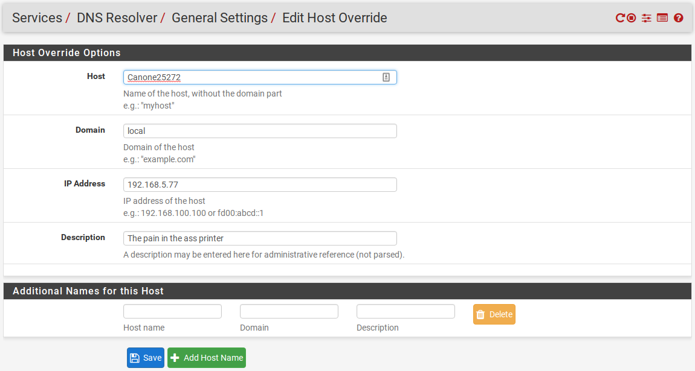

The Canon MF632Cdw working in Archlinux using IPP
============

The pain and the horror
--------------
So, interestingly enough, I have an openSuse installation on my wifes laptop, that detects, installs and sets up this printer with ease and comfort right out of the box. I believe it works with just about every application she has installed that is capable of printing. 

For the life of me(nearly) I could not get it working in ArchLinux for some hours, though I remember after just purchasing it, it **just worked** somewhow, but apparently must have stopped working between then and now.  At some point in time I even had the printer showing up with a different top level domain, but things really got squirrelly and I ended up factory resetting the printer and starting over.

Now that I have it working, I believe the underlying issue to simply be that Avahi was not setup to handle queries for the `.local` Top Level Domain. I did also do a little mad clicking with a couple of Guinness Nitro IPAs down the hatch, which can sometimes result is a little magic, but im pretty sure thats not what did it this time. 

For a couple of days I had everything working except Firefox, Vivaldi, and Chromium. I then realized the common trait between them was GTK3. I was missing the package `gtk3-print-backends`, and was not sending print jobs to the queue. Now FireFox and Vivaldi print Great!

Some points of interest
-------------
* Canon does not make a PPD file for Linux.
* When running `lpinfo -v` the printer shows up as:
  * dnssd://Canon%20MF632C%2F634C._ipp._tcp.local/?uuid=6d4ff0ce-6b11-11d8-8020-f80d60e25272
  * dnssd://Canon%20MF632C%2F634C._pdl-datastream._tcp.local/?uuid=6d4ff0ce-6b11-11d8-8020-f80d60e25272
  * socket://192.168.5.77
  * ipp://Canone25272.local:631/ipp/print
* The first three require a PPD file; 
* the last choice does not require a PPD as
* the MF632Cdw is able to use `driverless printing`.

#### A great resource on [Driverless Printing](https://wiki.debian.org/DriverlessPrinting) on the Debian Wiki

DNS issues
-----------
#### I eventually realized that Avahi and nsswitch.conf were the key to resolving the `.local` TLDs, but I found a fun work around using my DNS server too ( I think).
* The printer shows up as ipp://Canone25272**.local**:631/ipp/print 
* My Domain is somedomain.pw, so this will not resolve without intervention.

### A partial solution in pfSense

#### I added the Printer to my DNS resolver with a custom domain


### Dealing with `Avahi` and `nsswitch.conf`
#### My real problem was that `Avahi` was not set to handle queries for the `.local` Top Level Domain.


##### Taken from Archwiki
------------


   From <a href="https://en.wikipedia.org/wiki/Avahi_(software)">Wikipedia:Avahi (software)</a>
  <a href="http://avahi.org/">Avahi</a> is a free <a href="https://en.wikipedia.org/wiki/Zero-configuration_networking">Zero-configuration networking</a> (zeroconf) implementation, including a system for multicast DNS/DNS-SD service discovery. It allows programs to publish and discover services and hosts running on a local network with no specific configuration. For example you can plug into a network and instantly find printers to print to, files to look at and people to talk to. It is licensed under the GNU Lesser General Public License (LGPL).


### Installation
[Install](https://wiki.archlinux.org/index.php/Install) the <a href="https://www.archlinux.org/packages/?name=avahi">avahi</a> package.

You can manage the Avahi daemon with `avahi-daemon.service` [using systemd](https://wiki.archlinux.org/index.php/Systemd#Using_units).


### Using Avahi

#### Hostname resolution

Avahi provides local hostname resolution using a "hostname.local" naming scheme. To enable it, install the [nss-mdns](https://www.archlinux.org/packages/?name=nss-mdns) package and start `avahi-daemon.service`.

Then, edit the file `/etc/nsswitch.conf` and change the `hosts` line to include `mdns_minimal [NOTFOUND=return]` before `resolve` and `dns`:
```
hosts: ... mdns_minimal [NOTFOUND=return] resolve [!UNAVAIL=return] dns ...
```
Note: If you experience slowdowns in resolving `.local` hosts try to use `mdns4_minimal` instead of `mdns_minimal`.

##### Configuring mDNS for custom TLD
The `mdns_minimal` module handles queries for the `.local` TLD only. Note the `[NOTFOUND=return]`, which specifies that if `mdns_minimal` cannot find `*.local`, it will not continue to search for it in `dns`, `myhostname`, etc.

In case you want Avahi to support other TLDs, you should:

* replace `mdns_minimal [NOTFOUND=return]` with the full `mdns` module. There also are IPv4-only and IPv6-only modules `mdns[46](_minimal)`
* customize `/etc/avahi/avahi-daemon.conf` with the `domain-name` of your choice
* whitelist Avahi custom TLDs in `/etc/mdns.allow`
##### END Taken from Archwiki
------------


Adding the Printer to CUPS
----------------------

### Possible to create a PPD file and use `mdns` or `socket`?
* You can create a PPD file by using the `driverless` command, though I am not sure if this can only be used in a driverless setup using IPP.
  *  "When called without options, the IPP printer URIs of all available IPP printers will be listed."
 
  ```
  [root@jcomp jeremy]# driverless
  ipp://Canone25272.local:631/ipp/print

  ```
* Then run the driverless command again with the URI for the printer of interest.
  ```
    [root@jcomp jeremy]# driverless ipp://Canone25272.local:631/ipp/print
    *PPD-Adobe: "4.3"
    *FormatVersion: "4.3"
    *FileVersion: "2.2"
    *LanguageVersion: English
    *LanguageEncoding: ISOLatin1
    *PSVersion: "(3010.000) 0"
    *LanguageLevel: "3"
    *FileSystem: False
    *PCFileName: "ippeve.ppd"
    *Manufacturer: "CNMF632C/634C"
    *ModelName: "CNMF632C/634C CNMF632C/634C"
    *Product: "(CNMF632C/634C CNMF632C/634C)"
    *NickName: "CNMF632C/634C CNMF632C/634C, driverless, cups-filters 1.17.9"
    *ShortNickName: "CNMF632C/634C CNMF632C/634C"
    ...
   ```
   This will output the same PPD file that I believe would automatically be sent to CUPS when also contacting the printer on its own. I am not yet sure if this is the same PPD that would be required to setup a connection through socket:// for example. 
   
### Maybe creating your own print queue from the command line?
I tried, and it seemed to set it up ok, but I was not able to print, but this was before figuring out the Avahi/nsswitch.conf issue, and I havent tried yet since. 

*  As long as DNS is resolving for `Canonmf632.local` or the `nsswitch.conf` file is set up to do `.local` queries, you should be able to connect, finish the setup, and print.

```
[root@jcomp jeremy]# lpadmin -p myprintqueue -v ipp://Canonmf632.local:631/ipp/print -E -m everywhere

```
 
### Create the printer connection through CUPS 
* Access the web interface via [http://localhost:631](http://localhost:631)
* Go to `Administration`
* `Add printer`
* Choose one of the three `Discovered Network Printers`
 * The first one should be a `dnssd` name.
   * requires a ppd file
 * The second will be a `Socket` (like socket://192.168.5.77).
   * generally uses port 9100
   * requires a ppd file
 * The Third choice should be your driverless option.

* Finish filling stuff out and hope it connects


### Setup the printer through KDE Plasma!
 * I just right click on the Printer icon in the task manager and choose `Configure Printers`.
 * You can also go to `System Settings\Printers`.
 * You can add a printer, and it has basically all of the same options as in the CUPS web interface.


In Summary
-----------

1. Make sure your `/etc/nsswitch.conf` file is set to handle `*.local` queries.
  * My hosts line currently looks like:
  
   ```
   hosts: files mymachines mdns_minimal [NOTFOUND=return] resolve [!UNAVAIL=return] dns myhostname
   ```
2. Install the Printer through CUPS or some printer manager software that most likely still goes through CUPS.
3. Pick the Driverless Printing option.
   * Uses IPP and will have an address similar to ipp://Canone25272.local:631/ipp/print
4. Be sure `gtk3-print-backends` is installed, even in a Qt environment if using GTK apps that you may print from.

I can't believe my printer actually works!  

The great thing is, as more printers begin to support the Internet Printing Protocol, we will begin to see many more great printers available to the Linux Community!
