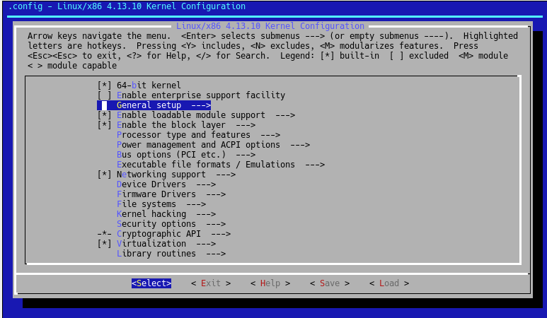
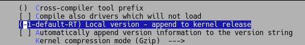
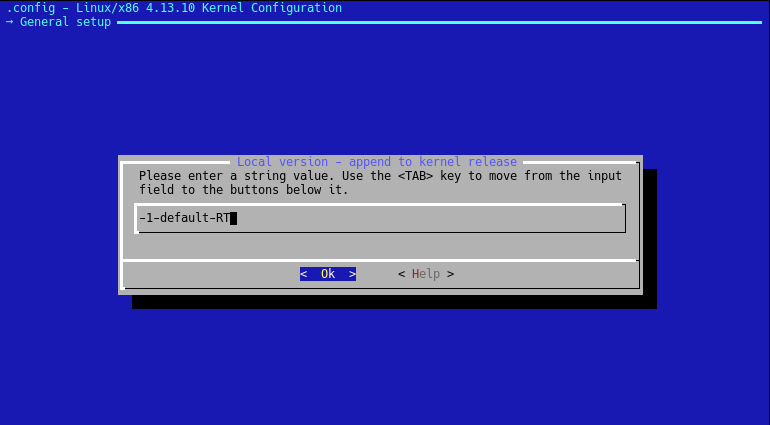
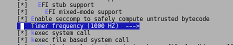
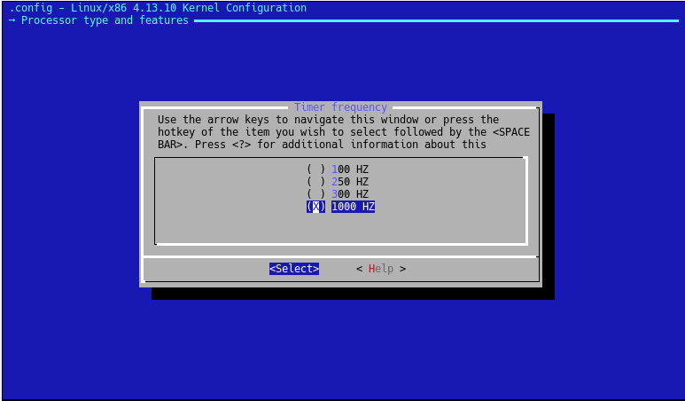
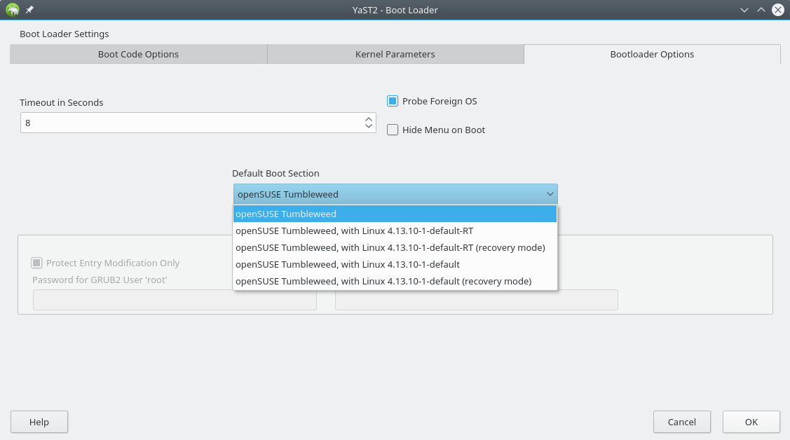

Kernel Compilation in openSuse Tumbleweed
================

Methods for Compilation
-----------------
There may be many ways to go about this, but the two ways we will cover here are compiling locally on the machine and compiling using the Suse Build Service:

* Compiling locally in the machine

* Compiling on the Suse Build Service


Prerequisites
------------

### Update the system to the latest Kernel and Software if you wish
<pre>
localhost:/home/user # <span style="color:#00d0ff">zypper dup</span>
</pre>

### Install packages required for development and Kernel compilation

<pre>
localhost:/home/user # <span style="color:#00d0ff">zypper install make gcc kernel-source ncurses-devel autoconf rpm-build bc libelf-devel</span>
</pre>

* `kernel-source` is the source code required to compile the kernel and modules for the kernel
* `gcc` is the compiler that will be used to compile our kernel
* `make` is the command that will be doing most of the heavy lifting
* `ncurses-devel` will be required when we run `make menuconfig` for our GUI type `.config` file manipulation
* `rpm-build` will be required if we choose to creat an rpm
* `bc` was required for some math related stuff, without it you end up with when running `make`
``` 
/bin/sh: bc: command not found
make[3]: *** [/usr/src/linux-4.13.10-1/./Kbuild:42: include/generated/timeconst.h] Error 127
make[2]: *** [/usr/src/linux-4.13.10-1/Makefile:1069: prepare0] Error 2
make[1]: *** [Makefile:145: sub-make] Error 2
make: *** [Makefile:24: __sub-make] Error 2
```
* `libelf-devel` without you may get "Cannot use CONFIG_STACK_VALIDATION, please install libelf-dev, libelf-devel or elfutils-libelf-devel" when running `make`

#### *Note: Other dependancy packages may get pulled in like 
* If you have problems compiling later, perhpas one of these are required but did not make it in.

> binutils bison bison-lang dwz gcc7 gettext-tools glibc-devel kernel-default-devel
kernel-devel kernel-macros libasan4 libatomic1 libcilkrts5 libitm1 liblsan0 
libmpx2 libmpxwrappers2 libopenssl-1_0_0-devel libopenssl-devel libtsan0 libubsan0 
linux-glibc-devel m4 patch systemd-rpm-macros tack zlib-devel 


Compiling locally on the machine
----------------
* We will be compiling in a sub directory within the `/usr/src/linux/` directory
* by default `/usr/src/linux/` will be a link to the latest installed kernel
* We will create a build directory seperate from `/usr/src/linux/`
  * Taken from `/usr/src/linux/README.SUSE` Under **COMPILING YOUR OWN KERNEL**
  > (2)  Create a build directory for use in configuring and building
       the kernel. Using /usr/src/linux directly requires root priviledges
       and will cause problems if you need to build kernel modules for
       other installed kernels.


### 1. Install the prerequisites and most importantly, the kernel sources

### 2. Create a build directory, 
* This can even be in your `/home/user` directory like  `/home/user/mybuildDir` for example

<pre>
user@localhost:~> <span style="color:#00d0ff">mkdir kernelBuilding</span>
user@localhost:~> <span style="color:#00d0ff">cd kernelBuilding</span>
user@localhost:~/kernelBuilding>
</pre>

### 3. Configure the Kernel
* Configure the kernel (for example, `make -C /usr/src/linux O=$(pwd) oldconfig`
* or `make -C /usr/src/linux O=$(pwd) cloneconfig`
* See  `/usr/src/linux/README.SUSE` **HOW TO CONFIGURE THE KERNEL SOURCES** section for more information

<pre>
user@localhost:~/kernelBuilding> <span style="color:#00d0ff">make -C /usr/src/linux O=$(pwd) cloneconfig</span>
</pre>

* You should now see a copy of the `.config` file that contains the kernel configuration for the currently running kernel
<pre>
user@localhost:~/kernelBuilding> <span style="color:#00d0ff">ls -la</span>
total 392
drwxr-xr-x  4 user users    113 Nov  7 12:39 .
drwxr-xr-x 18 user users   4096 Nov  7 12:37 ..
-rw-r--r--  1 user users 196456 Nov  7 12:38 .config
-rw-r--r--  1 user users 196470 Nov  7 12:38 .config.running
drwxr-xr-x  2 user users      6 Nov  7 12:39 kernelBuildingcd
-rw-r--r--  1 user users    609 Nov  7 12:38 Makefile
drwxr-xr-x  4 user users     34 Nov  7 12:38 scripts
lrwxrwxrwx  1 user users     24 Nov  7 12:38 source -> /usr/src/linux-4.13.10-1
</pre>

### 4. Run `make menuconfig`
* Run `make menuconfig` to change the configuration for the kernel you are about to build
  * I believe, if you do not specify a file to load, menuconfig will automatically load the `.config` file in the current directory
* Change at least the name of the kernel so it does not interfer with the current kernel when installed
* In this example we will be changing the name of the kernel and some timing settings

<pre>
user@localhost:~/kernelBuilding> <span style="color:#00d0ff">make menuconfig</span>
</pre>












### 5. Build the kernel and all its modules

<pre>
user@localhost:~/kernelBuilding> <span style="color:#00d0ff">make</span>
</pre>

### 6. Install the `Kernel Modules` in your new kernel
* From `/usr/src/linux/README.SUSE` "Make sure that the file /etc/modprobe.d/unsupported-modules contains ` allow_unsupported_modules 1`  otherwise modprobe will refuse to load any modules. Create the file if it does not exist."

<pre>
localhost:/home/octo/kernelBuilding # <span style="color:#00d0ff">make modules_install</span>
</pre>

* This will copy the compiled modules into `/lib/modules/<kernel version>-<config local version>`
    * In our case ` /lib/modules/4.13.10-1-default-RT/`

### 7. Install the `kernel`!

* From `/usr/src/linux/README.SUSE` This will automatically create an initrd for the new kernel as well (see ``mkinitrd -h'').

<pre>
localhost:/home/octo/kernelBuilding # <span style="color:#00d0ff">make install</span>
</pre>

* If all goes well you should now see your kernel in `/boot`

<pre>
localhost:/home/octo/kernelBuilding # <span style="color:#00d0ff">ls -la /boot</span>
total 227820
drwxr-xr-x 1 root root        858 Nov  8 12:33 .
drwxr-xr-x 1 root root        166 Nov  7 11:58 ..
-rw-r--r-- 1 root root        512 Nov  7 11:42 backup_mbr
-rw-r--r-- 1 root root       1725 Oct  2 14:08 boot.readme
-rw-r--r-- 1 root root     196470 Oct 31 13:23 config-4.13.10-1-default
<span style="color:#00d0ff">-rw-r--r-- 1 octo users    196472 Nov  7 12:48 config-4.13.10-1-default-RT</span>
drwxr-xr-x 1 root root        140 Nov  8 12:33 grub2
lrwxrwxrwx 1 root root         24 Nov  7 11:32 initrd -> initrd-4.13.10-1-default
-rw------- 1 root root   11810292 Nov  7 12:01 initrd-4.13.10-1-default
<span style="color:#00d0ff">-rw------- 1 root root   11822884 Nov  8 12:33 initrd-4.13.10-1-default-RT</span>
-rw-r--r-- 1 root root    1127522 Nov  4 18:09 symtypes-4.13.10-1-default.gz
-rw-r--r-- 1 root root     390387 Oct 31 14:26 symvers-4.13.10-1-default.gz
-rw-r--r-- 1 root root        484 Oct 31 14:26 sysctl.conf-4.13.10-1-default
-rw-r--r-- 1 root root    3415827 Oct 31 14:22 System.map-4.13.10-1-default
<span style="color:#00d0ff">-rw-r--r-- 1 octo users   3415827 Nov  7 15:46 System.map-4.13.10-1-default-RT</span>
-rw-r--r-- 1 root root   11209323 Oct 31 14:34 vmlinux-4.13.10-1-default.gz
<span style="color:#00d0ff">-rw-r--r-- 1 root root  175081609 Nov  8 12:31 vmlinux-4.13.10-1-default-RT.gz</span>
lrwxrwxrwx 1 root root         25 Nov  7 11:32 vmlinuz -> vmlinuz-4.13.10-1-default
-rw-r--r-- 1 root root    7294576 Oct 31 15:10 vmlinuz-4.13.10-1-default
-rw-r--r-- 1 root root         65 Oct 31 15:10 .vmlinuz-4.13.10-1-default.hmac
<span style="color:#00d0ff">-rw-r--r-- 1 octo users   7284496 Nov  7 15:46 vmlinuz-4.13.10-1-default-RT</span>
</pre>

### 8. Add your new kernel to the boot manager
* From `/usr/src/linux/README.SUSE`  "Add the kernel to the boot manager. When using lilo, run `lilo` to update the boot map."

#### We are using GRUB2

##### Files to make note of are:
* config file `/etc/default/grub`
* scripts like `/etc/grub.d/10_linux` which are responsible for noticing our new kernel 
* Grub2 config file in `/boot/grub2/grub.cfg` which **should NOT be edited by hand**

 * It would appear that an entry for our kernel is already in `/boot/grub2/grub.cfg`  
 *  The `/etc/grub.d/10_linux` was the responsible party 
 
 * Alternatively, we would have had to run `grub-mkconfig`
    <pre>
    localhost:/home/octo/kernelBuilding # <span style="color:#00d0ff">grub-mkconfig -o /boot/grub/grub.cfg</span>
    </pre>    
#### We can change the default kernel to boot from `Yast`


### 9. Reboot !


    
