Setting up Routes between GNS3 and the Azure Virtual Network
=======================
----------------------
You may be in a situation where a domain controller is just on the other side of an IPSec tunnel, and no extra routing setup is needed, but if the Domain Controller is behind yer another router, we will need to:
* Tell pfSense what networks are behind that other router
* Tell that other router where to send packets to reach the IPsec tunnel that terminated with pfSense.

When traffic destined for the subnet behind another router comes through the IPSec tunnel, pfSense needs to know where to send it to next. 

Our network topology on the GNS3 side:
------------

#### Screenshot of the topology in GNS3
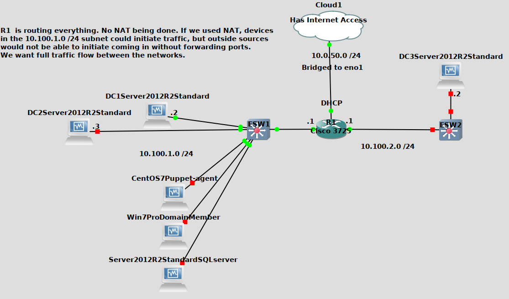

* The DCs IP address is 10.100.1.2
* Router R1's FastEthernet0/0 interface IP is 10.100.1.1 
* Router R1's FastEthernet1/0 interface IP is 10.0.50.170 given via DHCP by pfSense on the 10.0.50.0/24 subnet

#### A breif look at the status of the interfaces
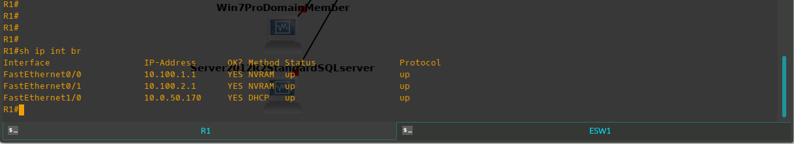

* The Default route most likely would have routed the 10.1.1.0/24 traffic toward 10.0.50.1, but we specfied it anyways
* The Interface IPs are statically set, except for Fa1/0. It is statically set in the DHCP setting in pfSense however

#### Small portion of the running config
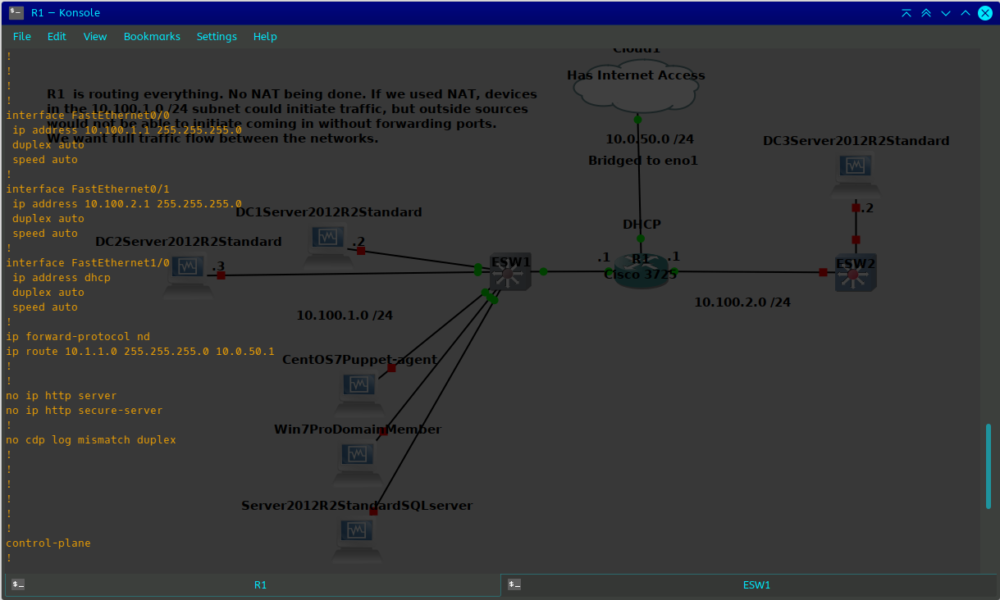

On the pfSense Side
-----------------

* We need to create a `Gateway` in pfSense in order to set a `Static Route` TO that Gatway
* Then we need to set a `Static Route` to the 10.100.1.0 /24 network.

#### Creating the Gatway
After logging into the pfSense WebGui interface:
* Go to `System`
* `Routing`
* Click the `Gateways` tab
* Then click `+ Add` to add a gateway
  * For `Interface` you want to choose the interface that belongs to the subnet which the gateway resides on.
    * In our case `VLAN50DATA` is the name of the pfSense interface that gave router R1 its DHCP aquired IP address
  * `Name` your gateway something representative I suppose
  * For `Gateway`, put the IP address of the router that leads to subnet we are trying to reach
  * This is not going to be my default gateway
  * If you disable Monitoring, pfSense just wont ping it once in a while to see if it is alive.
  * Add a `Description`, and hit `Save`
 
#### Adding the Gateway
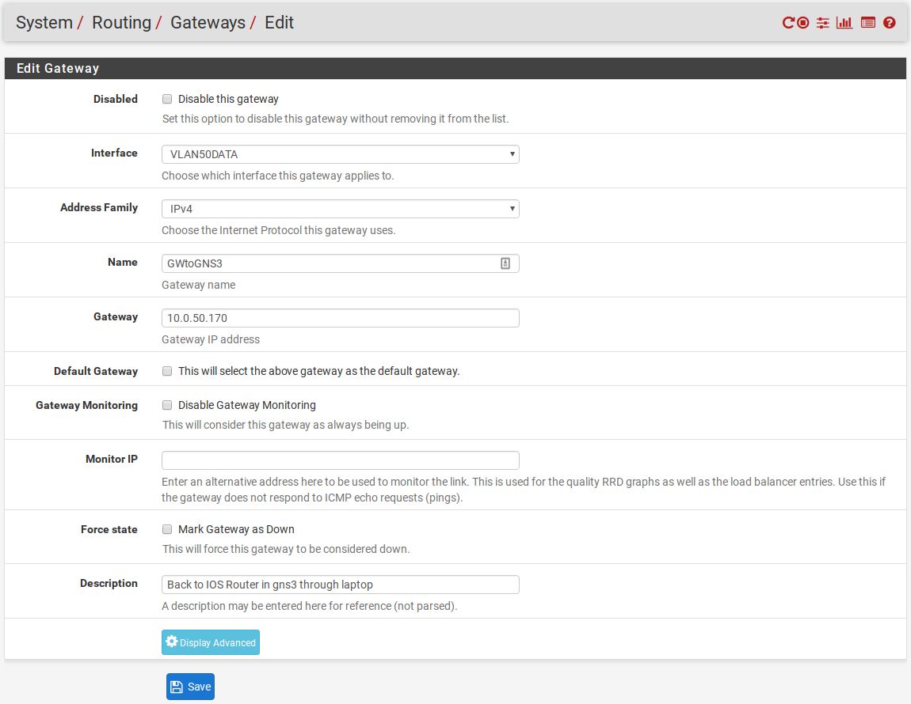

#### What it may look like when you are done adding a gateway
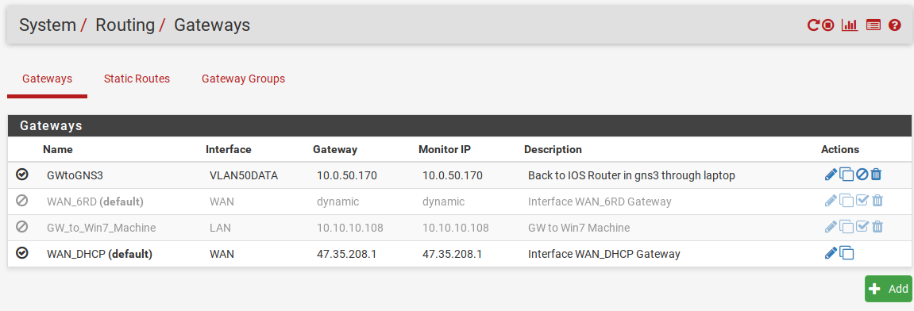

#### Adding a Static Route to that newly created gateway
* Go to `System`
* `Routing`
* Click the `Static Routes` tab
* Then click `+ Add` to add a static route
  * `Destination Network` will be the `10.100.1.0 /24` subnet we want to send to router R1
    * Notice the dropdown all the way to the right to choose your network mask
  * From the `Gateway` dropdown box, choose the gateway you just created
  * Add a `Description` and hit `Save`

#### What it may look like when you are done adding the static route
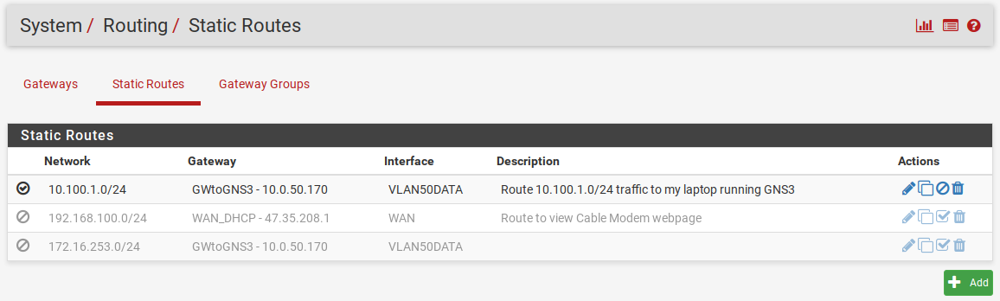

Testing our connectivity!
-------------------

Assuming that something may not work correctly, ill work my way toward the domain controller.

#### Ping from pfSense to the Azure Win 2012 VM
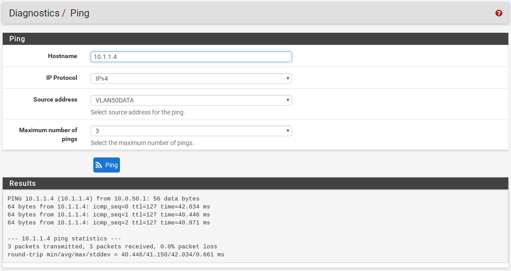

#### Pinging from the Laptop on the 10.0.50.0/24 Net
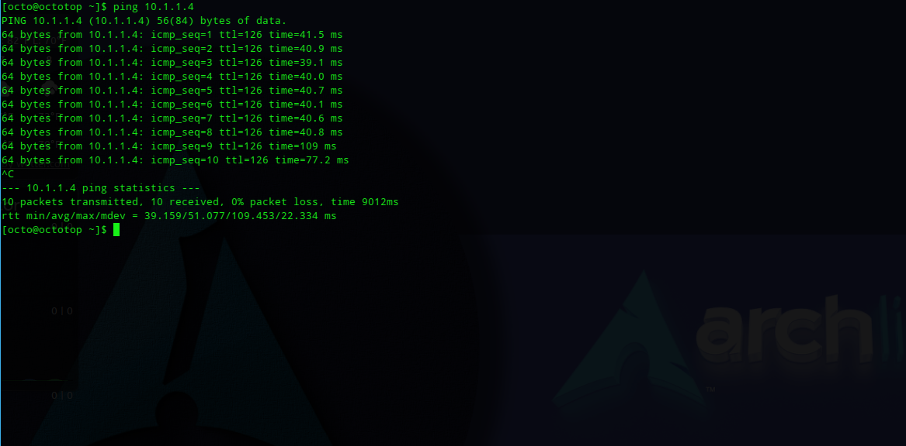

#### Pinging from R1 Interface on the 10.0.50.0/24 Net
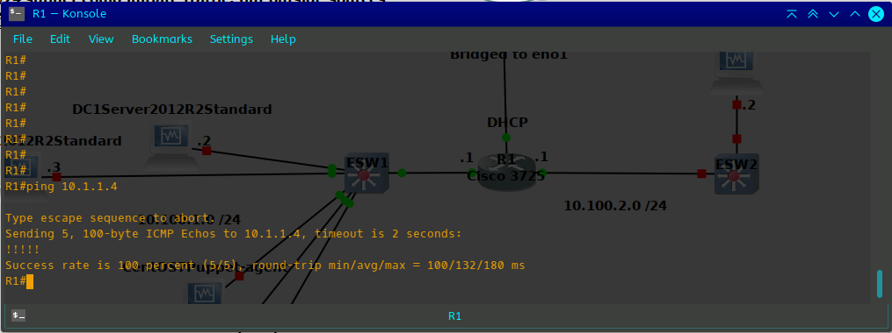

#### Pinging from the R1 Interface that is on the 10.100.1.0/24 Network
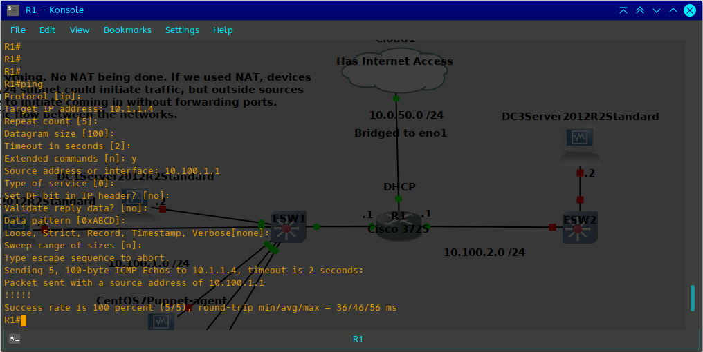

#### Finally pinging from Server 2012 on Premises
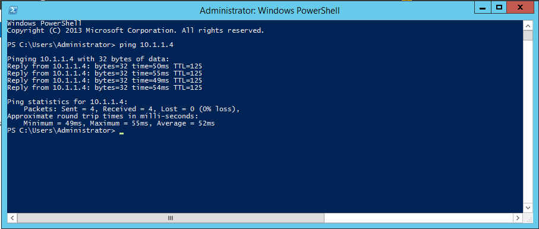

#### The real test is to ping from Server 2012 on the Azure side !!

